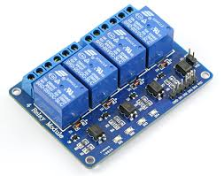
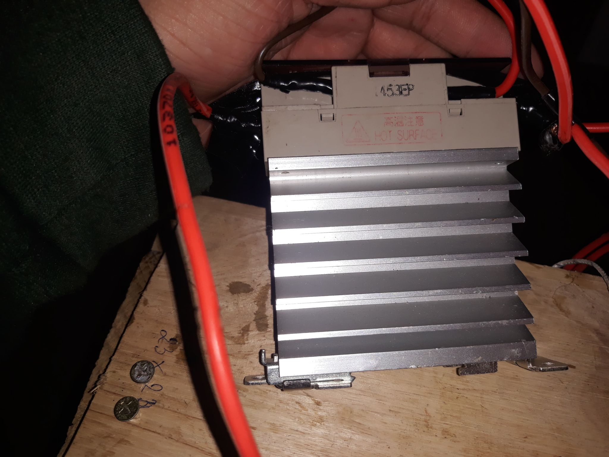
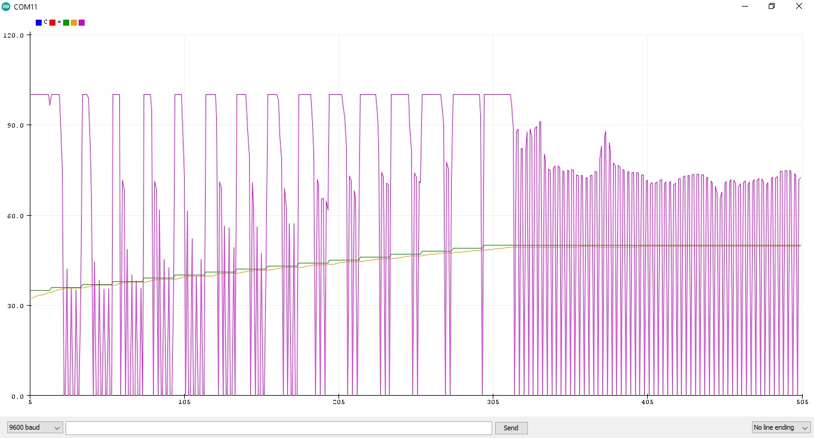

# Documents for PID Temperature Oven Controlled porject

- PID Temperature Oven is a study-project to learn PID controller for Temperature System like Egg Incubator. Project include 2 chapter: PID theory and Egg Incubator model using PID controller.
- Also I used 2 types of component: Relay and SSR to find which more suitable for controll Oven.

    Module 4 Relay 12V.

    SSR 220V0-24V.

- I used IC Max31855 to read signals from themocouples. And the figure follow show the results  of contoller.

    Result of PID controller for ramp function of setpoints with saturation.

